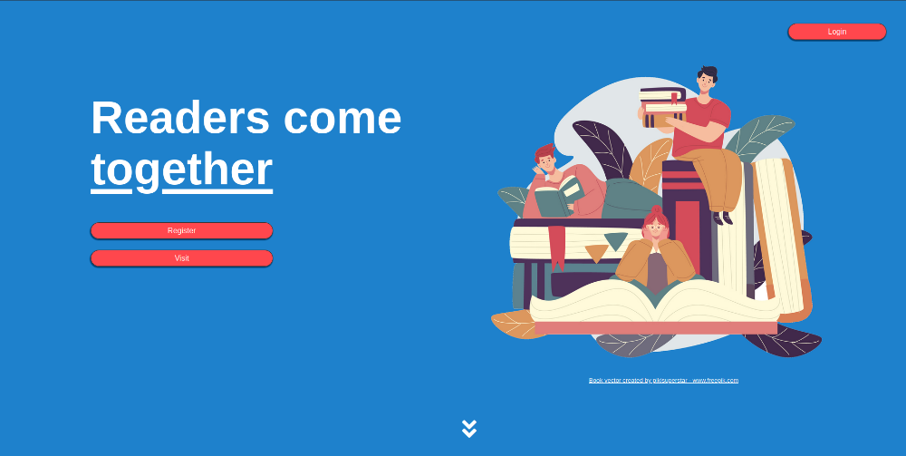
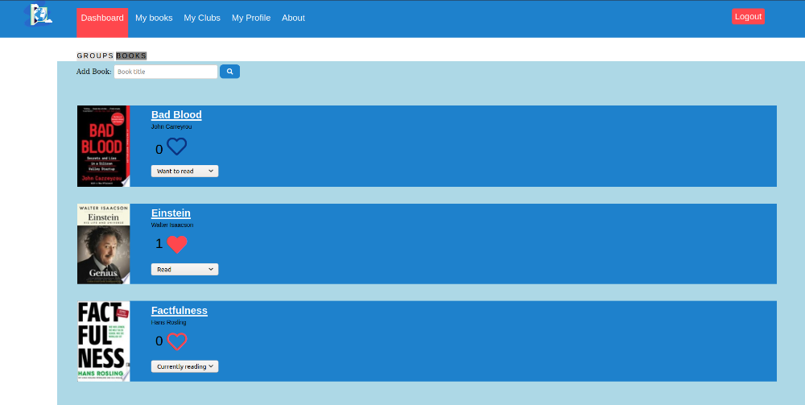
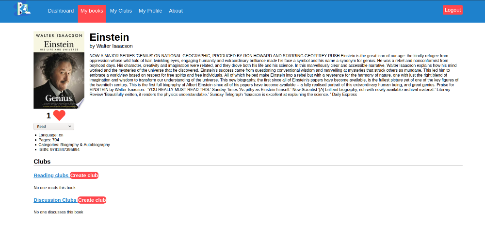
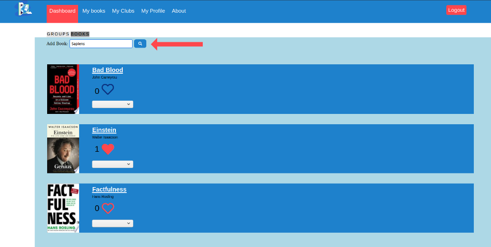
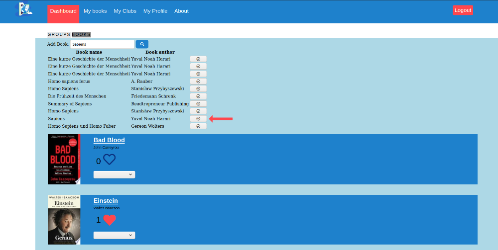
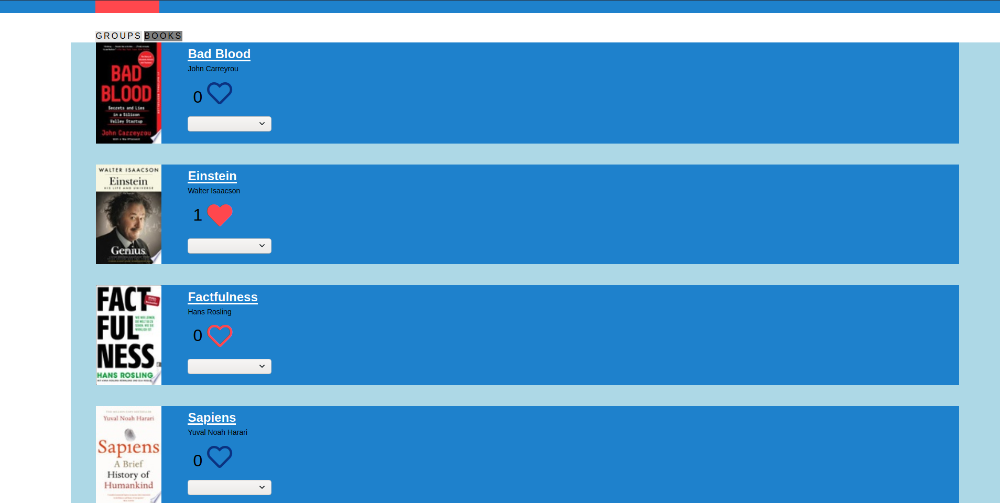
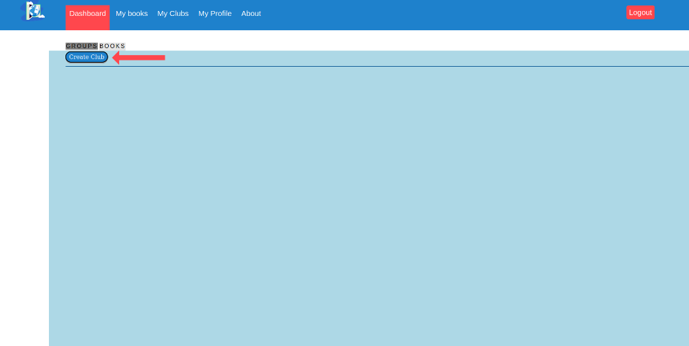
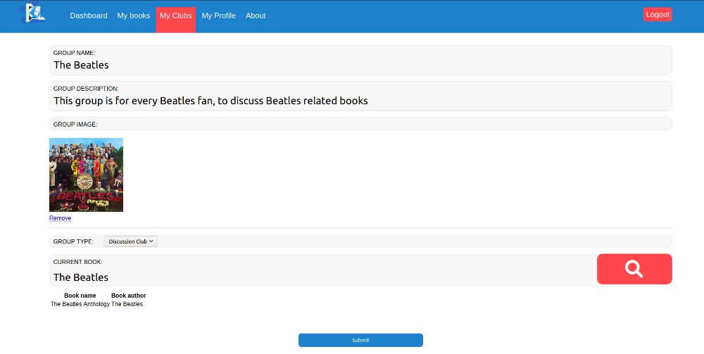
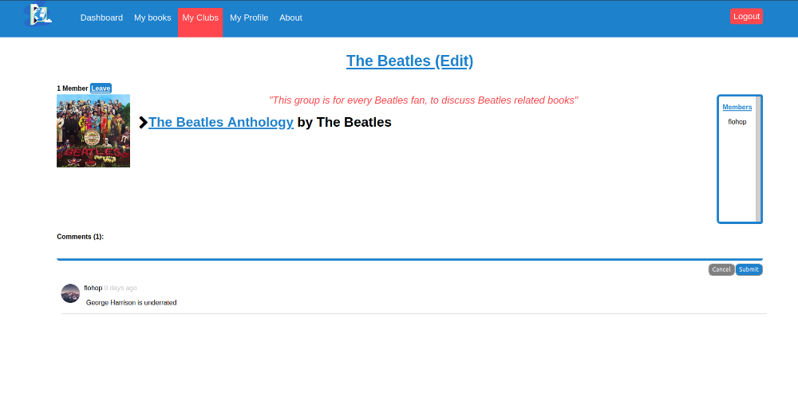
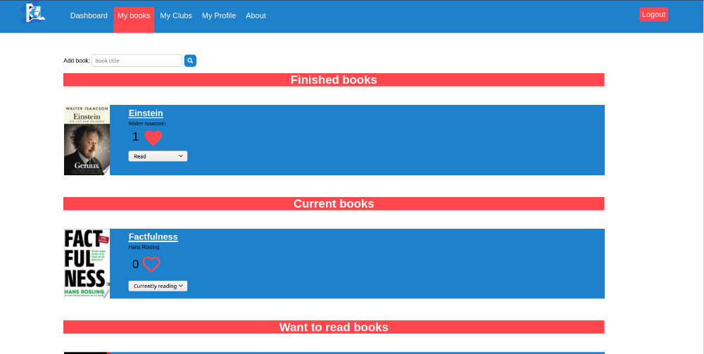

# GoodBookClubs

<h3>This website let's users create clubs to discuss books, or share their progress.</h3>

<h4>Disclaimer:</h4>

This website is still under production, although all main features work, there are still some bugs, I am working on fixing.

All images of the website you will see here are taken from local host, because I am currently working on deploying the website, but it's just not ready yet.

<h2>Landing page</h2>

This is the main landing page, from here you can either explore the rest of the landing page, login, or create an account.

 

 
 
<h2>Dashboard</h2>

On your dashboard, you can look at clubs and books. Viewing clubs, you can join or leave them. Viewing books, you can change the status of the book(Want to read/Reading/Read), and like the book, if you are at least reading the book at the moment. To dynamically handle, who can like a book, I used AJAX in combination with JavaScript(to add or remove element classes), CSS(to change the look) and Django(to store the changes).

<h2>Book details</h2>

By clicking on a book, you can explore the book deeper. You can see the author, a summary of the book, and other attributes.

<h2>Add books</h2>

Adding books to the website is extremly simple, just type the title of the book in the search bar and search for the book. Then confirm which book you meant and then you're finished. I am using Googles Book API to get the book data.

<h2>Clubs</h2>

The website is called GoodBookClubs, so it's about time we get to the clubs. On the dashboard you can also view all clubs. Clubs can have one of two types. Either it's a reading club, where people share their progress on a new book, or a discussion club, where people talk about books they have read.

<h2>Creating Clubs</h2>

Creating clubs is as easy as adding books. Just click on "Create club", fill in the needed data and your're all set!

<h2>Club Details</h2>

Let's have a look at our new club. Here you can see all the other members and leave comments to share your opinion.

<h2>Reading Clubs</h2>

Reading clubs are the second kind of clubs, they differ from the club we've just created in two ways. First you must have a current book, and second you can share your current progress. The group admin sets the goal and all the other members can share, if they've reached the goal.

<h2>Your bookshelf</h2>

Here you have all your books in a single place. You can view them, like them, or do whatever you want with them.

<h2>The Future</h2>

What you've just seen is only the beginning. Currently I am working on deploying the website, which isn't as easy as I had originally thought, because this website has so many dependencies(Postgresql Databank, image uploads etc.). But I'm making progress. After that, I want to work on some new features, to improve my web skills.

Thank you so much for taking the time, to read through my docs, I hope you are as excited about this as I am. Have a great day!

